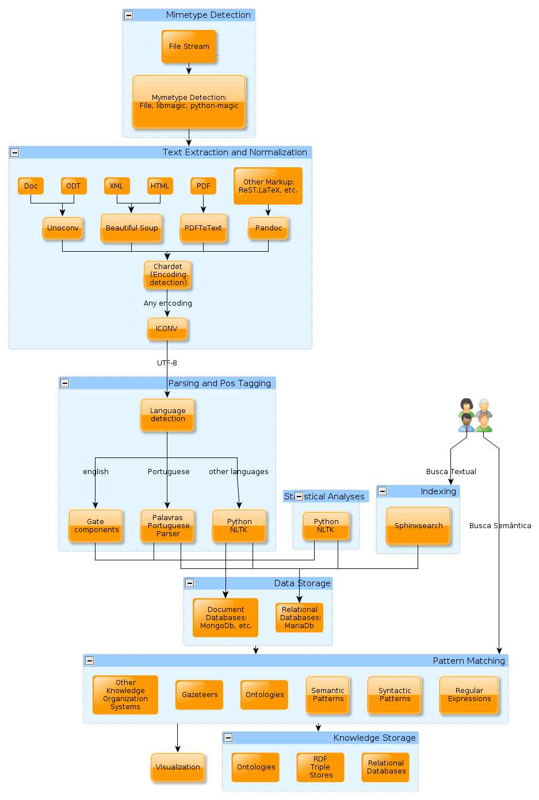
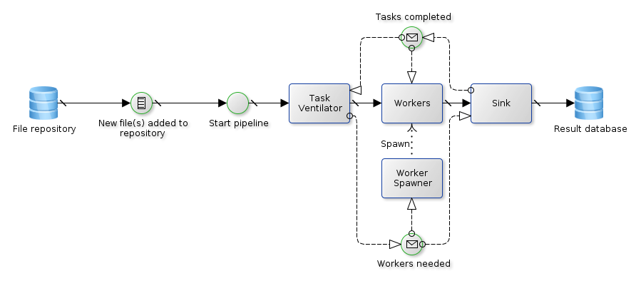
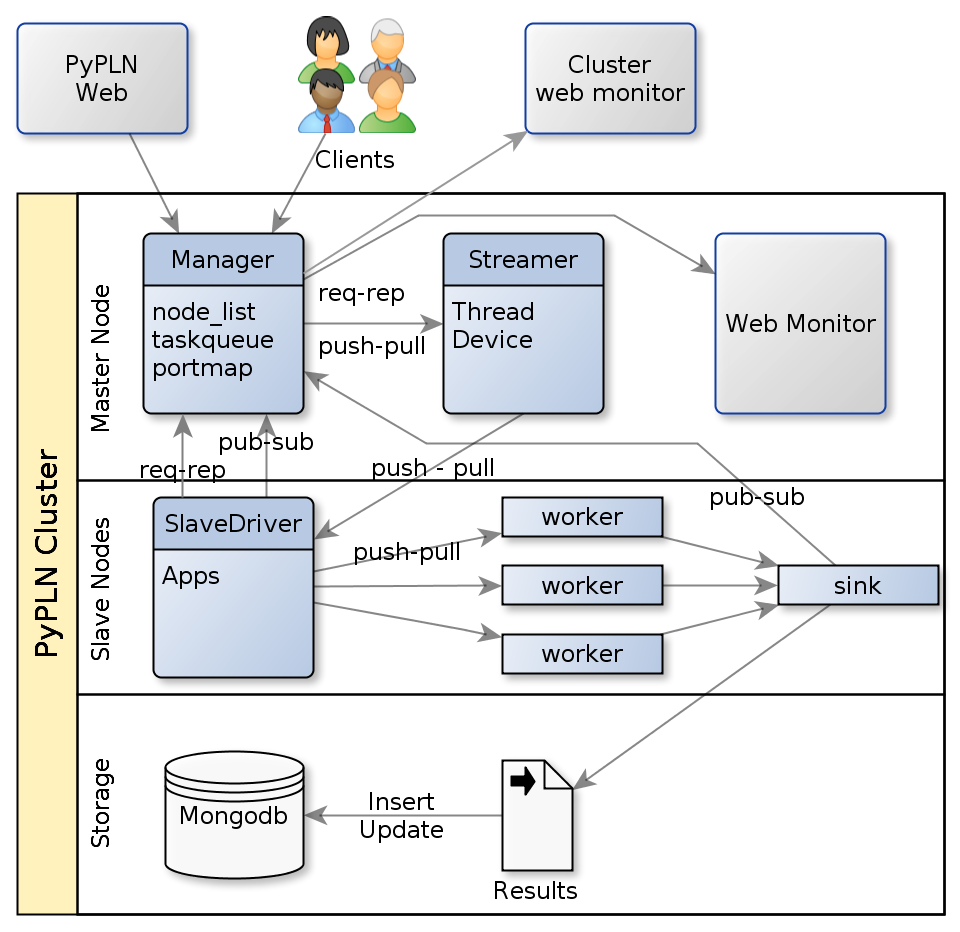

Introduction to PyPLN
=====================

**WARNING:** since we rebuilt our backend, this documentation is depreacted.
Come here in some days and we'll have an updated one.

PyPLN is a distributed pipeline architecture to analyze text. Conceptually, it was idealized to provide a complete analysis of textual documents in any format. A diagram of the currently envisioned analytical tasks can be seen on Figure :ref:`fig-cmap`.

.. _fig-cmap:

   Conceptual diagram of PyPLN

PyPLN makes use of well know text processing tools such as NLTK for natural language processing, and various other opensource tools for  text manipulation. PyPLN developers may develop new or improve existing tools for text/language processing but that is not the main development focus of the project. The main focus of PyPLN is providing a framework for efficient analysis of large collections of text. By efficient analysis we mean the combination of computational, mathematical and visualization techniques.

PyPLN relies heavily on distributed computing to be able to handle large collections of text. This distributed processing is built upon the ZeroMQ library and its API. Another key element to the scalability of our solution is the adoption of Mongodb for our storage backend. We use its replication and sharding capabilities to maintain IO performance.

An very simplified example of the inner working of a text processing job in PyPLN is depicted on figure :ref:`fig-arch`.

.. _fig-arch:

   Example text processing job PyPLN.

Cluster Architecture
--------------------

Although PyPLN can be run on a single server, it can be configured to take advantage of a cluster of machines. Its basic architecture is illustrated on figure :ref:`fig-cluster`.

.. _fig-cluster:

   General architecture of a PyPLN cluster

The cluster is manager by the manager process which interact with the client interfaces to distribute task to the cluster. But befor it can dedicate itsel to this key job. The manager also takes care of deploying Slavedriver processisn on each node of the cluster and minitoring them on a constant basis.

Once a new job reaches the managers it distributes it to one or more available Slavedrivers to work on it. The slavedrivers may start one or more apps on their nodes to handle the tasks it receives. The apps will launch multiple workers to crunch on the jobs. and monitor them for job completion or failure, notifying its slavedriver. Apps implements one of the distribution patterns implemented in baseapp.py. The most commonly used pattern is the task ventilator pattern.

Extending PyPLN
---------------

PyPLN can be extended through the implementation of new worker, sink or app.
New workers and sinks should mimic the dummy implentations provided and must subclass BaseWorker and BaseSink, respectively.
