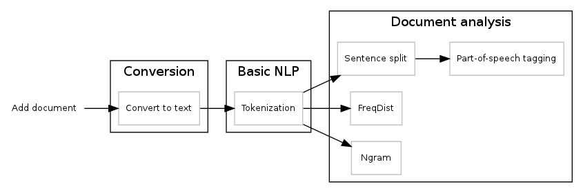

Storage Backend
===============

**WARNING:** since we rebuilt our backend, this documentation is depreacted.
Come here in some days and we'll have an updated one.

PyPLN can make use of various storage formats for both documents and analytical
results. Since PyPLN is built with distributed processing in mind, the
configuration of storage backends should, whenever possible be distributed as
well. That is all databases should be available to workers and sinks as local
resources, but at the same time be part of a distributed infrastructure, being
equally available to all machines in the cluster.

Whenever possible, we will use MongoDB document database to handle storage,
due to simplicity of its deployment and usage on distributed environments.

File Storage
------------

For PyPLN, document storage happens at more than one stage of of the pipeline.
At the beginning, we have the document files in their original formats prior to
the text extraction phase. To avoid resorting to specific implementations of
distributed filesystems, we use instead MongoDB's GridFS which transparently
handles distribution of files across the cluster without the need of extra
configurations.

Document Storage
----------------

For storing the raw text versions of the files and its analysis, PyPLN takes
advantage of the schemaless nature of MongoDB. MongoDB collections are sets of
JSON objects (which are stored internally in a binary format called BSON),
which in our case will be constructed gradually. Initially a document in a
MongoDB collection will have only one these fields::

    {'_id': ObjectId('...'),
     'meta': {
              'name': 'test.pdf',
              'created_on': '2012-05-29',
             },
     'analysis': {},
    }

When this document passes for a pipeline, each node of the pipeline (we call
these nodes "apps") will do some kind of analysis in the document and
optionally store more information. For example:

- ``extractor`` app extracts text from PDF files;
- ``tokenizer`` app extracts tokens from text;
- ``freqdist`` app extracts frequency distribution of tokens in the text;
- ``pos`` app extracts do the part-of-speech tagging;
- and so on...

   The PyPLN's default pipeline

Each of these new data will be available at the dictionary ``analysis``, inside
the MongoDB's document, for example::

    {'_id': ObjectId('...'),
     'meta': {
              'name': 'test.pdf',
              'created_on': '2012-05-29',
              'Author': u'Álvaro Justen',
              'Paper format': 'A4',
             },
     'analysis': {
                  'text': 'This is a sentence, this is a test.',
                  'tokens': ['This', 'is', 'a', 'sentence', ',', 'this', 'is',
                             'a', 'test', '.'],
                  'freqdist': [('a', 2), ('this', 2), ('is', 2),
                               ('sentence', 1), (',', 1), ('.', 1),
                               ('test', 1)],
                  'pos': [('This', 'DT'), ('is', 'VBZ'), ('a', 'DT'),
                          ('sentence', 'NN'), (',', ','), ('this', 'DT'),
                          ('is', 'VBZ'), ('a', 'DT'), ('test', 'NN'),
                          ('.', '.')],
     },
    }

In the example above, each app created an entry in ``analysis`` key of
MongoDB's document (``extractor`` created ``text``, ``tokenizer`` created
``tokens``, ``freqdist`` created ``freqdist`` and ``pos`` created ``pos``).
An app can also add file meta-information, for example, extractor can add
``document['meta']['Author']`` and ``document['meta']['Paper format']`` since
it's available in PDF meta-data and can be used for further analysis.

In the interface between the pipeline and the app must be a way to the app
to define which keys will be (optionally) created in ``document['analysis']``
and ``document['meta']``.
